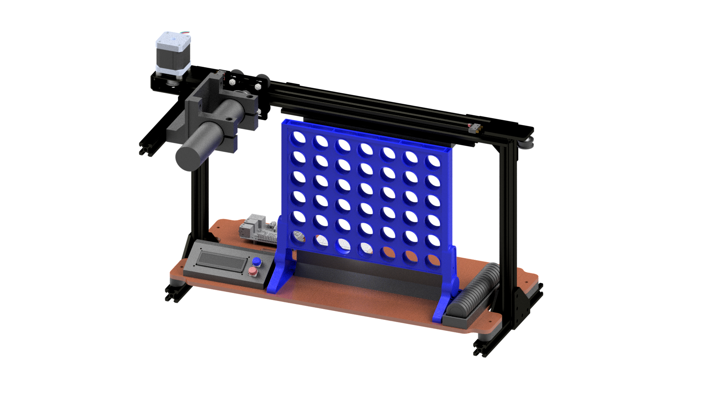

# MagDrop4
MagDrop4 is an interactive Connect4-playing machine designed to compete against a human player in real-time. The machine uses a custom-built linear belt actuator with an electromagnet to pick up magnetic game pieces from a magazine, move to the chosen column, and release each piece with accuracy. Sensors at each column track the human player's moves, allowing MagDrop4 to respond strategically, adapting its decisions based on the game’s progression. MagDrop4 showcases embedded system principles, combining real-time sensor feedback, mechanical actuation, and game strategy for an engaging human-machine interaction.

